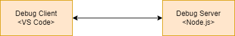

# Basic Client/Server Debugging in JavaScript
All debugging sessions consist of two processes; a debug server process running our source code and a debug client that attaches to the debug server and controls it. For the purposes of this document the debug client will be Visual Studio Code.

<br>
<p align="center">
  
</p>

**Note**
> The terms client and server here purely relate to the debug process. The debug server can be a client side application running in a browser of a server side application that serves up content.

Since IDEs can somewhat obfuscate the debugging we will start with a very explicit example. We will explicitly start the debug server using node with the **--inspect** flag to start as a debug server.

```
node --inspect Server.js
```

We should see the following output 

```
Debugger listening on ws://127.0.0.1:9229/35651d90-7192-456a-b1c4-e92f98f9a1ae
For help, see: https://nodejs.org/en/docs/inspector
Example app listening on port 3000
```

If we then open [Server.js](./Server.js) and ask to add a Node.js attach configuration we get a way to attach to our running Server.js After attaching our terminal looks like this

```
Debugger listening on ws://127.0.0.1:9229/35651d90-7192-456a-b1c4-e92f98f9a1ae
For help, see: https://nodejs.org/en/docs/inspector
Example app listening on port 3000
Debugger attached.
```

If we then put a brekpoint on our app.get handler and load the page http://localhost:3000/ will will hit our breakpoint and can then debug. 

## Getting Visual Studio to Launch and attach
We can get Visual Studio to launch our process in Node.js as a debug server by adding config like this

```json
        {
            "name": "Launch Program",
            "program": "${file}",
            "request": "launch",
            "skipFiles": [
                "<node_internals>/**"
            ],
            "type": "node"
        }
```
## Attaching to a Web Application
To attach to Chrome we need to run it with some extra arguments

```
"C:\Program Files\Google\Chrome\Application\chrome.exe" --remote-debugging-port=9222 --user-data-dir="C:\Users\kenne\AppData\Local\Google\Chrome\User Data"
```

If we start our [Server.js](./Server.js) from the terminal and then Chrome using the special arguments above we can open the link http://localhost:3000/app/Index.html 

**Note**
> You must kill all Chrome instances and only have the one running that has the debug arguments. Then you can attach and debug.


This project shows how to debug both server side and client side JavaScript applications using Visual Studio Code. The server is a simple Express based Node.js web server and the client is a single html page with a button that executes some JavaScript. To see how to setup look at [Basic Front-End and Back-End](../basic-front-end-and-back-end/README.MD). For detailed information on VS Code Debugging see [Debugging](https://code.visualstudio.com/Docs/editor/debugging).


## Debugging the Server
We can debug the server in two ways

 * Launch it from Visual Studio Code
 * Launch it from the terminal and attach Visual Studio Code

 Let us set up debug targets for both scenarios.

### Launching the Server.js in the Debugger
If we ask VS Code to add a debug configuration and select Node.js when the current file is not a JavaScript file it will add a generic configuration to launch and debug any open JavaScript file. 

```json
{
    "configurations": [
        {
            "type": "node",
            "request": "launch",
            "name": "Launch Program",
            "skipFiles": [
                "<node_internals>/**"
            ],
            "program": "${file}"
        }
    ]
}
```
If we run this configuration while our [Server.js](./Server.js) is open in the editor then Visual Studio Code will start this file in a Node process with debug turned on and then attach itself to said process as the debug client. 


## Launching the Server from the command line and attaching debugger
Run the server with debug in node as follows 

```
node --inspect Server.js
```

Node add a second target to the launch.json configurations 

```json
        {
            "name": "Attach Server",
            "port": 9229,
            "request": "attach",
            "skipFiles": [
                "<node_internals>/**"
            ],
            "type": "node"
        }
```
Use this to attach to the running process.

## Debugging the Client
We can debug the client in two ways

 * Launch it from Visual Studio Code
 * Open Chrome with special debug flags and attach

 ### Launch it in Chrome